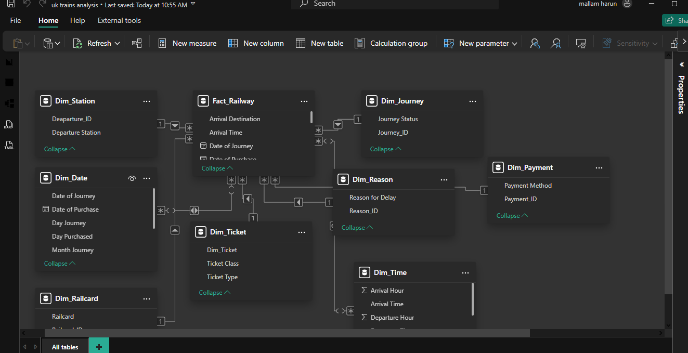

## NationalRail-DataDashboard 
# Data Modelling view

**Short Description:**  
Interactive **Power BI dashboard** analyzing UK National Rail ticket data. Includes **KPIs, revenue analysis, peak travel times, on-time performance**, and actionable insights using **DAX, Power Query, and data modeling**.

---

# National Rail Ticket Data Analysis Dashboard

## Project Overview
This project analyzes **UK National Rail train ticket data** from **January to April 2024**. The goal was to clean a **messy dataset**, develop a **data model**, and provide actionable insights for business decision-making using **Power BI**.

The dataset included ticket information such as **Ticket Type, Ticket Class, Departure & Arrival Stations, Trip Times, Prices, Journey Status**, and more.

---

## Tools Used
* **Power BI** – dashboard development and visualization  
* **DAX** – calculations, KPI measures, % comparisons  
* **Power Query** – data cleaning and transformation  
* **Data Modeling** – creating **fact and dimension tables**, establishing **relationships**, and developing a **star schema**

---

## Analysis Performed
This dashboard answers key business questions:

1. **Most Popular Routes**  
   * Identified top train routes by passenger count  
   * **Visuals:** Bar chart, Table  
   * **Insight:** London → Manchester is the busiest route, followed by London → Birmingham

2. **Peak Travel Times**  
   * Determined busiest hours of the day (morning, afternoon, evening)  
   * **Visuals:** Line chart, Column chart, KPI cards  
   * **Insight:** Morning trips are the highest (17k trips), 183% higher than Afternoon (6k trips). Evening trips are second busiest (12k)

3. **Revenue Variation by Ticket Types and Classes**  
   * Compared revenue from **Ticket Types** and **Ticket Classes**  
   * **Visuals:** Bar chart, Pie chart  
   * **Insight:** Anytime tickets generate the most revenue. First Class tickets generate higher revenue per trip than Standard

4. **On-Time Performance and Contributing Factors**  
   * Evaluated % of trips **on-time, delayed, or cancelled**  
   * **Visuals:** Donut/Pie chart, Table for reasons of delay  
   * **Insight:** 85% of trips were on time. Main reasons for delays: **technical issues** and **weather**

---

## Insights and Recommendations
* **Morning trips** are consistently the busiest. Consider increasing capacity during morning peak hours.  
* **Revenue is highest from Anytime tickets and First Class**, so promotions could target these segments.  
* **Technical issues** are the main cause of delays — maintenance improvements can enhance reliability.  
* **Messy raw data** was transformed using **Power Query**, and the **data model** ensures accurate reporting and future analysis.

---

## Dashboard Features
* Interactive **KPI cards** showing trips and % changes between periods  
* **Column and line charts** for route popularity and peak travel times  
* **Revenue breakdown** by Ticket Type and Class  
* **On-time performance analysis** with main delay causes  
* **Q&A feature** for natural language queries in Power BI

---

This project demonstrates the ability to **clean messy datasets**, create **robust data models**, apply **DAX measures**, build **interactive dashboards**, and deliver **actionable business insights**.
